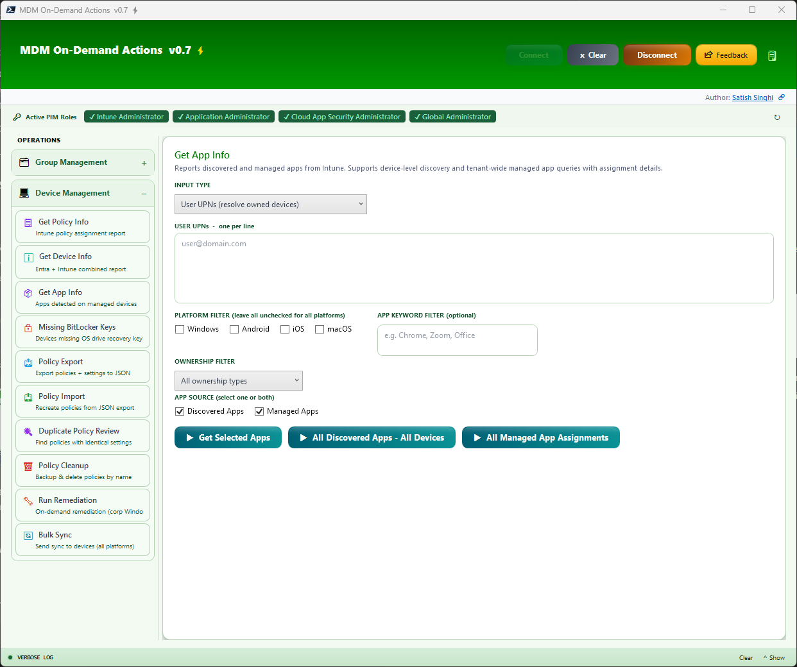
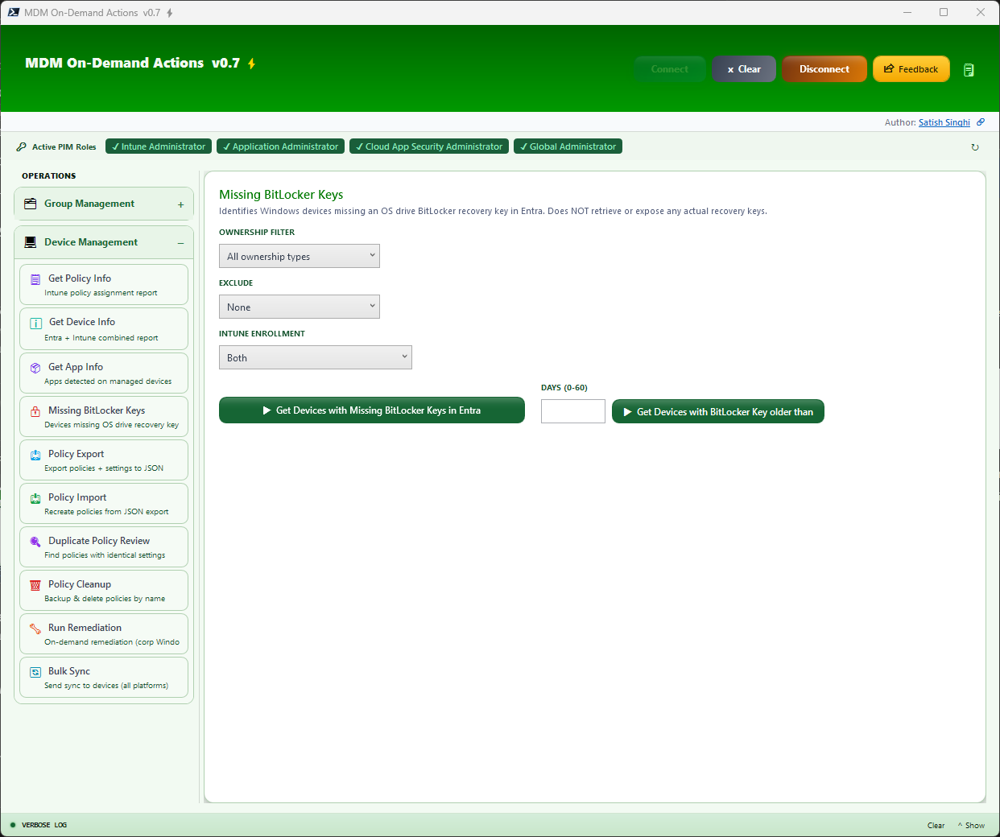
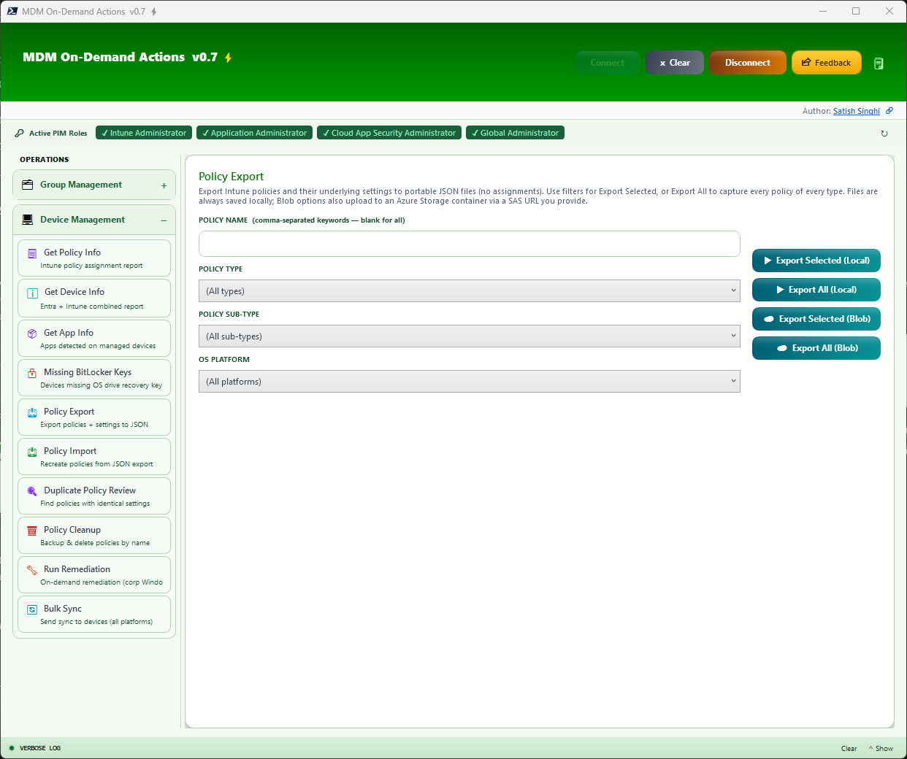
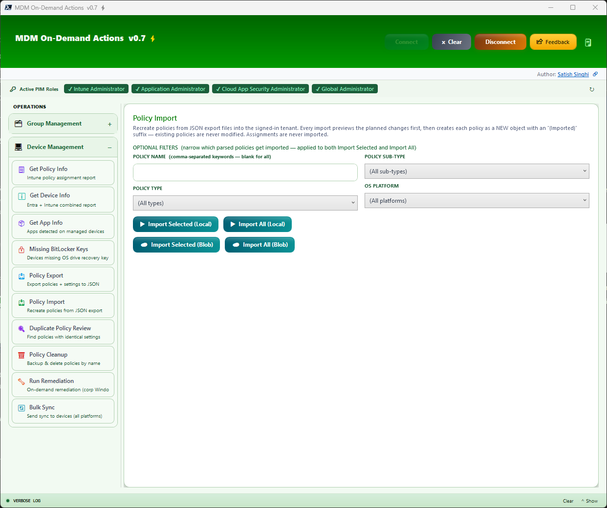
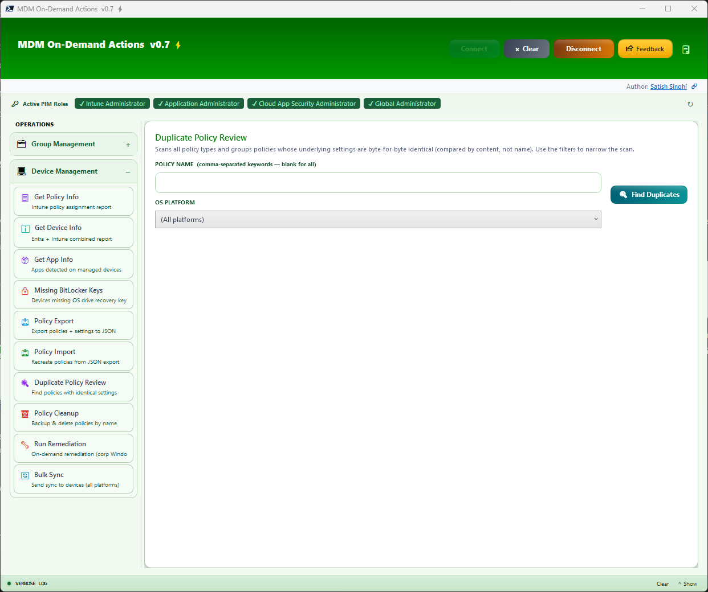
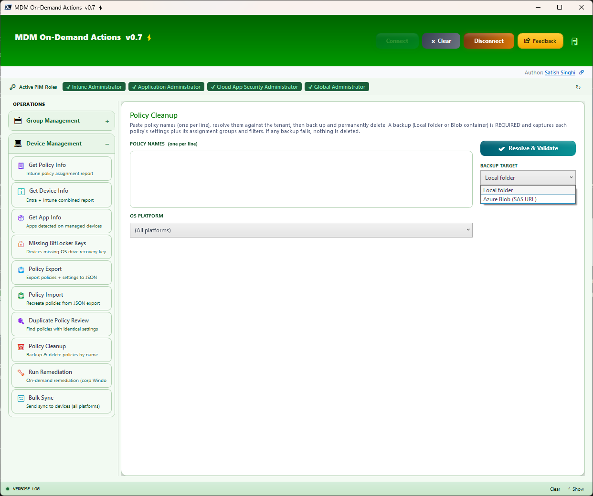
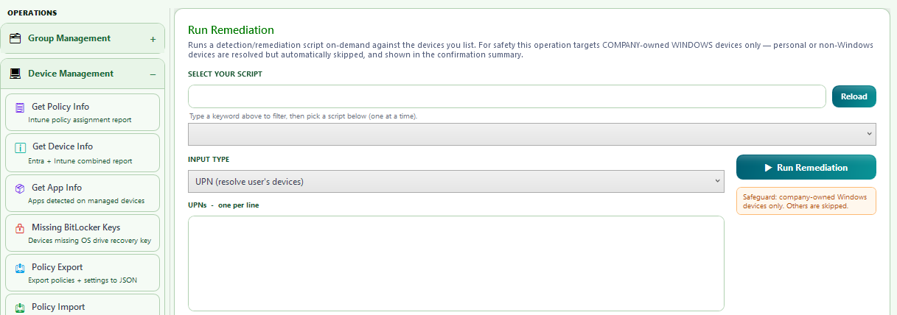

# MDM On-Demand Actions (MDM-ODA) &#x26A1;

**Live Analytics, Insights & Actions for Entra ID and Intune**

[](https://github.com/satishsinghi-gh/mdm-oda/releases)
[](https://learn.microsoft.com/en-us/powershell/)
[](https://learn.microsoft.com/en-us/dotnet/desktop/wpf/)
[](https://learn.microsoft.com/en-us/graph/)
[](https://satishsinghi-gh.github.io/MDM-ODA/)

---


## Overview

MDM-ODA is a PowerShell & WPF based plug-n-play tool for Entra & Intune on-demand operations. Built with attention to detail for the granular challenges faced by support teams, enabling project teams to get reliable, meaningful, up-to-date insights and reports on the go. Built with safeguards to prevent accidental actions, keeping Zero Trust and least privilege as top priority.

> For a full deep-dive into the tool's design, architecture, and security model, visit the [MDM-ODA Blog](https://satishsinghi-gh.github.io/MDM-ODA/).

### Project Mission

- Maximize operational efficiency
- Automate variety of on-demand actions that need to be performed on the go
- Deliver a thoughtful, well-crafted experience that IT professionals genuinely enjoy using
- Bring together data from different portals/pages using a single page — no browser tab madness
- Surface actionable insights directly — no Excel exports, no manual pivot tables, just immediate clarity for faster triage
- Automate bulk actions on-demand that are natively not possible
- Reduce human errors using validation workflows
- Save hours of efforts and endless fatigue caused by repetitive tasks
- No manual setup needed, no admin rights needed — just plug and play
- Make Click-Ops great again

## Highlights

| | |
|---|---|
| **Lightweight & Powerful** | Enterprise-grade functionality built entirely on native Windows components — PowerShell 7 and WPF. Zero third-party dependencies, zero licensing. All data is live from Microsoft Graph — no Power BI refresh cycles, no stale dashboards. |
| **Security & Guardrails** | Delegated auth flow for least privilege — use your Tenant & Client ID. Validation & preview before each write action. Live verbose logging for transparency. No admin rights required. |
| **Productivity** | Complex on-demand actions with minimum effort. In-page live table output with flexibility to select cells, copy individual cell/row/all, or export to XLSX. |

## Features — Group Management

<details>
<summary><strong>Search Entra Objects</strong> — Bulk multi-type search across Entra objects with manager lookup</summary>


*Search across Users, Groups, Devices, and Service Principals with real-time filtering*
</details>

<details>
<summary><strong>List Group Members</strong> — List members from multiple groups with a single click</summary>


*Query members from multiple groups simultaneously with comprehensive details*
</details>

<details>
<summary><strong>Object Membership</strong> — Find group membership for bulk items (Users/Devices/Groups)</summary>


*Bulk lookup of group membership across users, devices, and groups*
</details>

<details>
<summary><strong>Find Groups by Owners</strong> — Enter UPNs to find owned groups, or leave empty to find groups without owners</summary>


*Identify all groups owned by specific users with detailed ownership insights*
</details>

<details>
<summary><strong>Create Group</strong> — Create Security/M365 Group with bulk owners, members, or dynamic query from a single page</summary>


*Streamlined group creation with owners, members, and dynamic rules — no CSV, no browser navigation*
</details>

<details>
<summary><strong>Set Bulk Owners on Bulk Groups</strong> — Assign multiple owners to multiple groups in one operation</summary>


*Bulk owner assignment across multiple groups with validation*
</details>

<details>
<summary><strong>Add User Devices to Groups</strong> — Enter UPNs, auto-resolve their registered devices and add to groups</summary>


*Device-to-group assignment driven by user identity*
</details>

<details>
<summary><strong>Find Common/Distinct Groups</strong> — Compare group memberships across multiple objects</summary>


*Identify overlapping and unique group memberships for users, devices, or groups*
</details>

<details>
<summary><strong>Compare Groups</strong> — Side-by-side comparison of group properties and memberships</summary>


*Detailed group comparison with property and membership diff*
</details>

### Additional Group Management

- **User Direct Reports** — Enter UPNs or Object IDs to list each user's direct reports
- **Get Group Owner** — Bulk lookup of group ownership
- **Rename Bulk Groups** — Rename multiple groups at once
- **Update Dynamic Membership Rules** — Modify dynamic queries on existing groups
- **Delete Empty Groups** — Safely remove groups with zero members (with confirmation)

## Features — Device Management

<details>
<summary><strong>Device Info</strong> — Comprehensive device details from Entra and Intune in one view</summary>


*Hardware, OS, compliance, encryption, and registration details from a single query*
</details>

<details>
<summary><strong>Get Policy Info</strong> — Comprehensive policy assignment report including Compliance, Autopilot, Device Prep, and ESP</summary>


*Policy assignment overview with group context*


*Detailed policy breakdown with assignment intent and filter evaluation*


*Full policy assignment landscape across configuration profiles, compliance, and apps*
</details>

<details>
<summary><strong>Get App Info</strong> — Discovered and managed app insights with assignment details</summary>


*Query Discovered Apps, Managed Apps, or both simultaneously. View managed app assignment details including groups, filters, and filter modes. Input Devices, Users (devices resolved based on filters), or Groups (resolves nested groups). Filter by Platform, Ownership, and Keywords.*
</details>

<details>
<summary><strong>Missing BitLocker Keys</strong> — Audit Windows devices missing an OS drive recovery key in Entra (NEW in V0.8)</summary>


*Identifies Windows devices that have no OS drive BitLocker recovery key backed up to Entra ID — a critical escrow-compliance audit. A second mode reports devices whose newest key is older than N days (0–60). Filter by Ownership, Intune enrollment state, and exclusions. Output carries the same rich 30+ column user/device detail as Get Device Info. The tool only reads key metadata — it never retrieves or exposes actual recovery keys.*
</details>

<details>
<summary><strong>Policy Export</strong> — Export policies + underlying settings to portable JSON (NEW in V0.8)</summary>


*Export Intune policies with their full underlying settings (no assignments) to portable JSON files. Covers Device Configurations, Settings Catalog & Endpoint Security (incl. Firewall), Administrative Templates (incl. bundling of custom/ingested ADMX+ADML files), PowerShell Scripts, Detection/Remediation Scripts, classic Autopilot Deployment Profiles, and Enrollment Status Pages. Export Selected (filtered by comma-separated keywords, Type, Sub-Type, Platform) or Export All. Files are always saved locally; Blob options additionally upload to an Azure Storage container via a SAS URL you provide.*
</details>

<details>
<summary><strong>Policy Import</strong> — Recreate policies from JSON exports with preview & duplicate detection (NEW in V0.8)</summary>


*Recreate policies from JSON export files (local folder or Azure Blob) into the signed-in tenant — ideal for tenant-to-tenant migration, lab seeding, and configuration backup/restore. Every import previews the planned changes first, then creates each policy as a NEW object with an "(Imported)" suffix — existing policies are never modified and assignments are never imported. Content-based duplicate detection flags policies already present in the target (compared by settings, not name) with Proceed / Skip Duplicates options. Cross-tenant dependencies (reusable settings, custom ADMX definitions) are detected and reported with actionable skip reasons, and custom ADMX administrative templates are automatically ingested and remapped in the target tenant.*
</details>

<details>
<summary><strong>Duplicate Policy Review</strong> — Find policies with identical settings content (NEW in V0.8)</summary>


*Scans all policy types and groups policies whose underlying settings are identical — compared by content, not by name. Surfaces Policy Name, Platform, Policy Type, Last Modified, and Assignment Groups so you can consolidate redundant policies with confidence. Keyword and platform filters narrow the scan.*
</details>

<details>
<summary><strong>Policy Cleanup</strong> — Backup & delete policies by name with a mandatory safety net (NEW in V0.8)</summary>


*Paste policy names (one per line), resolve them against the tenant, then back up and permanently delete. A backup target (local folder or Azure Blob via SAS URL) is REQUIRED — the backup JSON captures each policy's full settings plus its assignment groups and filters. If any backup fails, nothing is deleted. Resolve → Preview → Explicit Confirmation → Delete.*
</details>

<details>
<summary><strong>Run Remediation</strong> — On-demand remediation scripts against listed devices (NEW in V0.8)</summary>


*Run a detection/remediation script on-demand against the devices you list — same action as the Intune console's "Run remediation", but in bulk. Pick a script from the pre-loaded dropdown with type-ahead keyword filtering. Input UPNs, Device Names, Entra Device IDs, Intune Device IDs, Serial Numbers, or Groups (user inputs resolve to their devices). For safety this operation targets COMPANY-owned WINDOWS devices only — personal or non-Windows devices are resolved but automatically skipped and shown in the confirmation summary. A full validation workflow shows the script and resolved devices with Proceed/Cancel before anything runs.*
</details>

<details>
<summary><strong>Bulk Sync</strong> — Send Intune sync to devices at scale (NEW in V0.8)</summary>

*Trigger an Intune device sync across bulk devices — all platforms, corporate and personal, with an optional platform filter. Same flexible input types as Run Remediation and the same validation workflow before the sync fires.*
</details>

## Productivity Features

<details>
<summary><strong>Session Notes</strong> — Built-in notepad for each session with timestamp and context</summary>


*Take notes during operations without leaving the tool*
</details>

<details>
<summary><strong>Verbose Logging & Keyword Filter</strong> — Real-time operation logging with search</summary>


*Filter logs by keyword for quick troubleshooting*


*Detailed operation logs with timestamps*
</details>

<details>
<summary><strong>Prerequisite Handling</strong> — Automatic detection and installation of dependencies</summary>


*Automatic detection of system prerequisites*


*Installation progress and status reporting*
</details>

### Additional Productivity Controls

- **Clear Inputs** — Clear the page and start fresh with a single click
- **Stop Operation** — Cancel ongoing operations at any time without waiting for completion
- **Feedback** — Built-in feedback mechanism to report issues or suggest improvements

## Security & Auth Design

MDM-ODA uses the OAuth 2.0 delegated flow exclusively — the app never holds standalone permissions. Every API call executes in the context of the signed-in user, meaning the effective permission is always the intersection of what the app registration allows and what the user's Entra/Intune roles permit. The recommended configuration uses **read-only API scopes** for everyday operations. Write permissions are only needed when performing create, update, or delete operations.

Every write action follows a strict validation-before-commit workflow: the tool validates input format, checks for duplicates, resolves object identifiers, and presents a structured preview of pending changes. Only after the user explicitly confirms does the operation execute. Destructive operations carry additional guardrails — Policy Cleanup refuses to delete anything unless a verified backup succeeds first, and Run Remediation is hard-scoped to corporate-owned Windows devices.

> For the full architecture diagram and detailed auth flow, see the [blog](https://satishsinghi-gh.github.io/MDM-ODA/).

## Prerequisites

1. **Windows 11** with WPF (built-in, no additional installation needed)
2. **PowerShell 7** — handled automatically by the script (auto-installs via winget if missing). The orchestrator can be launched from a standard PowerShell 5.1 host — it detects the running version, locates or installs PS7, and re-launches itself in the PS7 runtime automatically
3. **Internet Connectivity** — required for PowerShell Gallery modules and Microsoft Graph API
4. **No Admin Rights Required** — MDM-ODA runs in user context
5. **Code Signing & WDAC** — if WDAC or script execution policies are enforced, code signing adjustments may be needed

## Getting Started

```powershell
# 1. Clone the repository
git clone https://github.com/satishsinghi-gh/mdm-oda.git

# 2. Configure credentials (optional) — pre-populate your Tenant ID and Client ID
#    in the script, or enter them manually at launch

# 3. Launch the downloaded script — no parameters, no admin rights needed
.\MDM-ODA.ps1

# 4. Authenticate with your Entra credentials and start using the tool
```

### What's Included

- Fully functional PowerShell 7 script with embedded WPF UI
- Automatic prerequisite detection and installation
- Microsoft Graph SDK integration for reliable API calls
- Real-time verbose logging to local file system
- Validation workflows for write operations
- Export to Excel (XLSX) capability
- Complete source code and documentation

## Permissions

### Delegated App Permissions — Core (read-only)

| Permission | Purpose |
|---|---|
| `User.Read` | Sign-in and read current user profile (/me for PIM checks) |
| `User.Read.All` | Resolve UPN inputs and read user properties across all functions |
| `Group.Read.All` | Read group properties, list groups, read types and membership rules |
| `GroupMember.Read.All` | List group members and query member counts |
| `Directory.Read.All` | TransitiveMemberOf for PIM role detection and object membership |
| `Device.Read.All` | Resolve devices, read properties, query registered users |
| `DeviceManagementConfiguration.Read.All` | Read Intune config profiles, policies, and scripts for assignment lookups and Policy Export |
| `DeviceManagementManagedDevices.Read.All` | Query managed devices by Azure AD device ID or serial number |
| `DeviceManagementApps.Read.All` | Read Intune managed and discovered apps, app assignments, and configurations |
| `BitlockerKey.ReadBasic.All` | Enumerate BitLocker recovery key metadata for the Missing BitLocker Keys audit — key material is never read (use `BitlockerKey.Read.All` only if your tenant policy requires it) |
| `offline_access` | Maintain refresh token for persistent session |

### Delegated App Permissions — Feature-based (write)

Only needed if you use the corresponding operation:

| Permission | Required by |
|---|---|
| `DeviceManagementConfiguration.ReadWrite.All` | Policy Import (create policies/scripts), Policy Cleanup (delete policies) |
| `DeviceManagementServiceConfig.ReadWrite.All` | Policy Import of classic Autopilot Deployment Profiles and Enrollment Status Pages |
| `DeviceManagementManagedDevices.PrivilegedOperations.All` | Run Remediation (on-demand remediation) and Bulk Sync (device sync remote actions) |

> **Note:** The documented least-privileged permissions for group write operations are `Group.ReadWrite.All` and `GroupMember.ReadWrite.All`. However, based on testing, group owners with scoped Intune RBAC roles can perform all write operations with only the read-only scopes above. If you want to guarantee write access regardless of ownership, add `Group.ReadWrite.All` and `GroupMember.ReadWrite.All`.

### User Permissions

Entra built-in roles or custom RBAC roles determine which specific resources a user can access. The app permissions set the API surface ceiling, but Intune RBAC and group ownership scope the actual access. **Group Owners** is sufficient for most group management operations. For comprehensive device and policy insights, users may benefit from **Intune Reader** or **Intune Administrator** roles depending on scope. Policy Import/Cleanup, Run Remediation, and Bulk Sync additionally require an Intune role that permits the corresponding write/remote actions.

### Web Application Redirect URI

For WAM (Web Account Manager) based authentication, configure the following redirect URI in your Entra app registration:

```
ms-appx-web://Microsoft.AAD.BrokerPlugin/{Client-ID}
```

Replace `{Client-ID}` with your actual Application (client) ID from Entra.

## Changelog — V0.8

### New Features

**Policy Export & Policy Import**
- Export policies + full underlying settings to portable JSON across 7 policy types — Device Configurations, Settings Catalog & Endpoint Security, Administrative Templates, PowerShell Scripts, Detection/Remediation Scripts, Autopilot Deployment Profiles, Enrollment Status Pages
- Local folder always; optional Azure Blob container upload/import via SAS URL
- Import preview with planned changes; policies created as NEW objects with "(Imported)" suffix — existing policies never touched, assignments never imported
- Content-based duplicate detection (settings hash, not name) with Proceed / Skip Duplicates workflow
- Custom/ingested ADMX administrative templates: ADMX+ADML bundled on export, automatically ingested and definition-remapped on import
- Cross-tenant dependency detection with actionable Skipped reasons (reusable settings groups, missing custom ADMX)
- Multi-keyword comma-separated filtering honored across Local and Blob operations

**Duplicate Policy Review**
- Content-based duplicate detection across all policy types — finds policies whose settings are identical even when names differ
- Output includes Assignment Groups and Last Modified for consolidation decisions

**Policy Cleanup**
- Backup-and-delete workflow: Resolve → Preview → Explicit Confirm → Delete
- Backup to local folder or Azure Blob is mandatory and captures settings + assignment groups + filters per policy; delete does not proceed if any backup fails

**Run Remediation**
- On-demand detection/remediation script execution against listed devices — console-parity remote action, results in seconds
- Script dropdown with type-ahead keyword filter; inputs: UPN / Device Name / Entra Device ID / Intune Device ID / Serial Number / Groups
- Safeguard: corporate-owned Windows devices only — everything else auto-skipped and disclosed in the confirmation summary

**Bulk Sync**
- Bulk Intune device sync across all platforms and ownership types with platform filter and validation workflow

**Missing BitLocker Keys**
- Audit Windows devices missing an OS drive BitLocker recovery key in Entra
- "Key older than N days" mode (0–60) for escrow-freshness auditing
- Ownership, exclusion, and Intune enrollment filters; full Get Device Info column set
- Reads key metadata only — never retrieves recovery key material

### Improvements

- Get Device Info: tenant-wide device pre-fetch eliminates per-device Graph round-trips for large queries
- Verbose logging: buffered writer with quiet mode for high-volume operations
- Real HTTP status capture and failure diagnostics dumps for import troubleshooting
- Graceful Stop across all long-running operations

<details>
<summary><strong>Previous Changelog — V0.7</strong></summary>

**Get App Info** (Major Enhancement) — Discovered/Managed apps, assignment details with filters and filter modes, Platform/Ownership/Keyword filters, Device/User/Group inputs.

**Search Entra Objects** — bulk multi-type input with deduplication; Get Manager checkbox.

**Find Groups by Owners** — empty input returns all groups without an owner.

**Get Policy Info** (renamed from "Get Policy Assignments") — Compliance Policy assignments, classic Autopilot Profile report, Autopilot Device Preparation report, ESP report with priority.

**Improvements** — horizontal scroll bars and resizable columns on all output tables.
</details>

## Roadmap

MDM-ODA is actively evolving. Here's what's planned for upcoming releases:

- **Comprehensive Update Insights** — Quality Updates, Feature Updates, Driver Updates
- **Defender Integration** — Timeline Events, Advanced Hunting, Vulnerability State, Software Inventory
- **Advanced Policy Management Actions** — Targeted modifications, cloning, bulk assignment management
- **Reusable Settings Dependencies** — Import support for reusable settings groups referenced by Settings Catalog policies
- **Advanced Dynamic Group Query Builder** — Visual query builder with syntax validation and preview
- **Log Analytics Integration** — Extended Hardware Inventory and Audit data from Log Analytics

## Author

**Satish Singhi**

> [!WARNING]
> **Disclaimer:** This tool is provided "as-is" without warranty of any kind, express or implied. The author assumes no liability for any damages arising from its use. Always validate operations in a non-production environment before deploying to production tenants.

## License

This project is licensed under the [MIT License](LICENSE).
